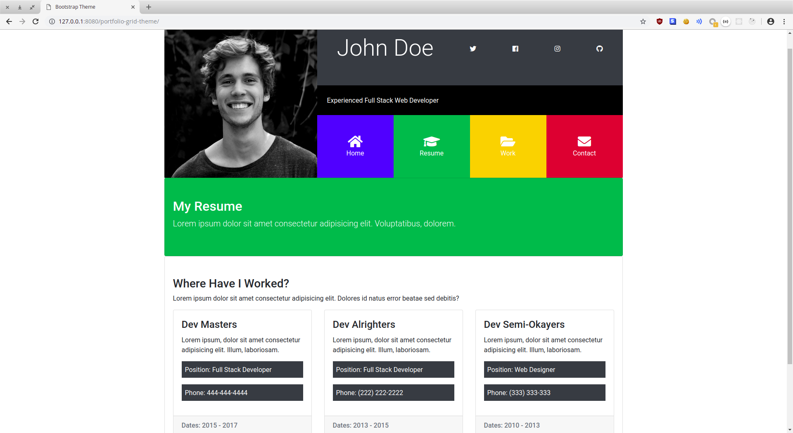

## Work from Udemy course "Bootstrap 4 From Scratch With 5 Projects"

#### This repository hosts all my work from the various coding challenges and projects completed while taking this udemy course: https://www.udemy.com/bootstrap-4-from-scratch-with-5-projects/. 

#### From the course you learn:

* How to create amazing high quality Bootstrap 4 themes and UIs from scratch
* Semantic HTML5 & modern CSS3 techniques
* Bootstrap 4 utilities, classes, components & JS widgets using a custom sandbox environment
* How to compile Sass in the easiest way possible using a GUI
* All about Bootstrap 4 via the creation of 5 real projects / themes, including:
    * **LoopLap** - A social UI theme
    * **Mizuxe** - A Book/Product Showcase Theme (Sass Project)
    * **Blogen** - A blog admin area UI
    * **Glozzom** - A multi page theme with a carousel and some 3rd party scripts
    * **Portfoligrid** - A portfolio theme using the grid, flexbox and the collapse widget

#### It's a great course and I highly recommend it!

### Below are some screenshots of the various themes you build throughout the course.

#### "Looplab" Social Network Theme

#### "Mizuxe" Book Promotion Theme

#### "Glozzom" Multi Page Theme

#### Portfolio Grid Theme

#### "Blogen" Admin UI Theme

